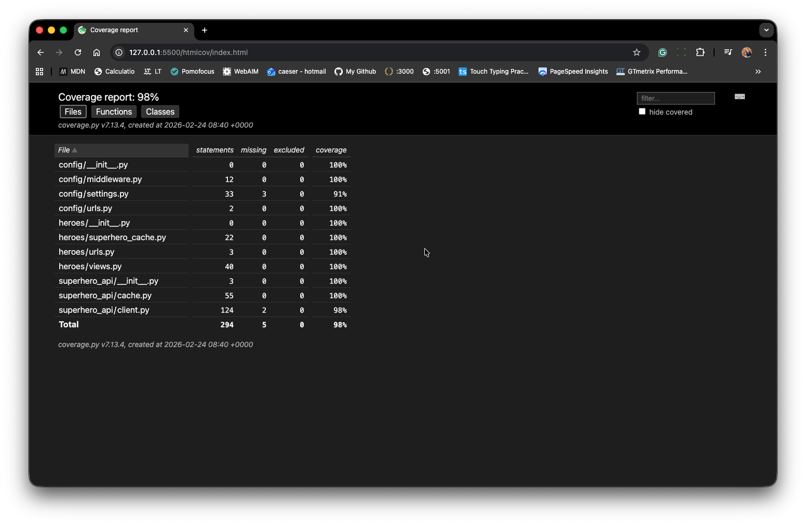
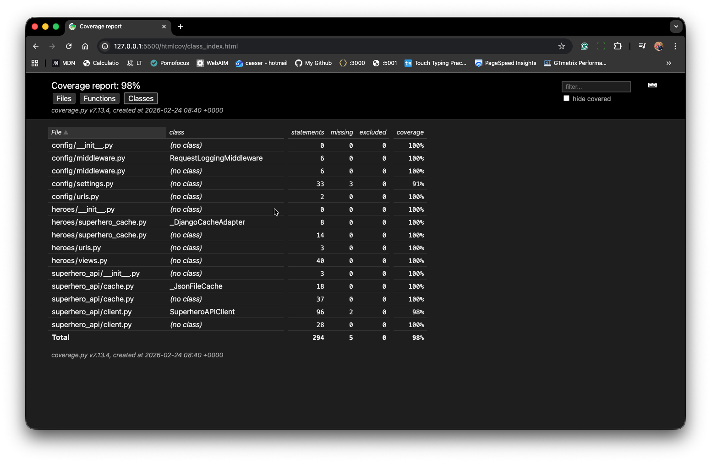

# Super Heroes – Defaqto Technical Challenge

A small Python project that integrates with the [Superhero API](https://superheroapi.com/), caches responses, and provides a Django UI to browse superheroes and their appearance details.

**Architecture:** Django app that talks to the Superhero API via a reusable `superhero_api` client; the client uses a cache layer (Django’s cache in the web app, or an optional file cache elsewhere) so repeated requests don’t hit the API unnecessarily.

### [Live on https://caeserlondon.pythonanywhere.com/](https://caeserlondon.pythonanywhere.com)

---

## Tests and coverage

Tests are written with **pytest** and **pytest-django**. The suite includes **unit tests** (client, cache, views with mocks) and **integration tests** (`tests/test_integration.py`): full stack (view → real client → real Django cache) with only external HTTP (CDN) mocked. Coverage includes the Django app (`heroes`), the API client package (`superhero_api`), and project config (`config`).

**Run all tests**

```bash
source .venv/bin/activate
pytest tests/ -v
```

**Run tests with coverage (terminal report)**

```bash
pytest tests/ --cov=heroes --cov=superhero_api --cov=config --cov-report=term-missing
```

**Generate HTML coverage report**

```bash
pytest tests/ --cov=heroes --cov=superhero_api --cov=config --cov-report=html
```

This creates a `htmlcov/` folder. **Open `htmlcov/index.html` in your browser** to view the interactive coverage report (per-file coverage, line highlighting, and missing lines).

The `htmlcov/` folder is committed in this repo so reviewers can open the report without running pytest.

---

**Health check:** [http://127.0.0.1:8000/health/](http://127.0.0.1:8000/health/) returns `{"status": "ok"}` for load balancers and monitoring.

---

## CI (GitHub Actions)

On every push (and pull request) to `main` or `master`, GitHub Actions runs the test suite with coverage. Check the **Actions** tab on the repo to see that tests run automatically.

---

|              Test files              |               Test classes               |
| :----------------------------------: | :--------------------------------------: |
|  |  |

---

## Features

- **API integration**: Fetches superhero data (name, appearance, biography, powerstats) from the Superhero API. If `SUPERHERO_API_TOKEN` is not set, the app falls back to the same dataset from [akabab/superhero-api](https://github.com/akabab/superhero-api) so it runs without a token.
- **Caching**: Django’s built-in cache stores API responses so repeated list/detail views do not hit the API unnecessarily. Default backend is in-memory; you can switch to Redis, Memcached, or database cache in `config/settings.py`.
- **Django UI**: List view of superheroes with thumbnails; detail view per hero (appearance, biography, powerstats). Images use the CDN (`cdn.jsdelivr.net/...`) to avoid Cloudflare blocking.
- **Health endpoint**: `/health/` returns JSON for monitoring.
- **Request logging**: Middleware logs method, path, status code, and duration for each request.

---

## Project layout

- **`config/`** – Django settings, root URLs, WSGI, request-logging middleware.
- **`heroes/`** – Django app: views (list, detail, favicon, health), URLs, templates, Django cache adapter for the API client.
- **`superhero_api/`** – Reusable package: API client (`client.py`), optional file cache (`cache.py`). Used by the web app with the Django cache adapter.
- **`tests/`** – Pytest test suite: unit tests (client, cache, views, Django cache adapter) and integration tests (full stack, CDN mocked).

---

## Design notes

- **Cache**: The Django app uses Django’s cache via `heroes/superhero_cache.py`.
- **Fallback**: When no token is set, the client fetches `all.json` from the akabab CDN, normalises it to the same shape as the API, and caches it.
- **Images**: All image URLs are built with `hero_image_url(id, name)` using the CDN and slug format.

---

## Run the app

1. **Clone and enter the project**

   ```bash
   cd super-heros
   ```

2. **Create a virtual environment and install dependencies**

   ```bash
   python3 -m venv .venv
   source .venv/bin/activate   # On Windows: .venv\Scripts\activate
   pip install -r requirements.txt
   ```

3. **Optional: Superhero API token**  
   For the official API, get a token at [superheroapi.com](https://superheroapi.com/) (GitHub login). Set `SUPERHERO_API_TOKEN=your-token` in a `.env` file or in your shell. Without a token, the app uses a fallback dataset and still works.

4. **Start the server**

   ```bash
   python manage.py runserver
   ```

   Open [http://127.0.0.1:8000/](http://127.0.0.1:8000/). The first load may take a few seconds while data is fetched and cached; later requests are served from the cache.
